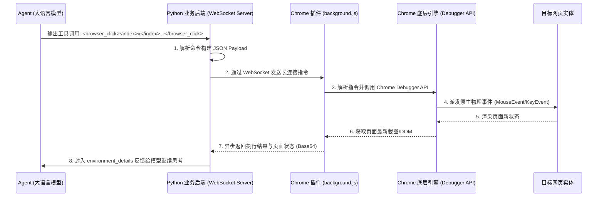

# AI Agent Debugger Host (Pro)
## 浏览器自动化智能代理控制台 - 架构与集成说明文档

本项目是一个基于 Chrome 开发者工具协议 (CDP) 的浏览器控制中心。它的核心目标是：**为基于大语言模型（LLM）的智能代理（Agent）提供一个稳定、直接且绕过常规反爬限制的浏览器操控“物理之手”与“视觉感知”能力。**

本文档面向后端 Agent 研发团队，详细说明了本项目的整体架构、前后端通信协议，以及如何将大模型的指令动作映射并集成到真实业务流中。

---

## 一、 系统架构概览

传统的浏览器自动化（如 Puppeteer, Selenium）通常通过启动无头浏览器（Headless Browser）来实现，这不仅占用资源极大，而且极易被复杂网站的检测机制拦截，同时也丢失了用户的日常登录态（Cookies/Sessions）。

**本项目的创新架构如下：**



1. **宿主环境集成**：插件直接安装在用户日常使用的真实浏览器上（非无痕模式），完美继承所有账号登录态。
2. **高速长连接双工通信**：后端与浏览器插件之间建立 WebSocket 连接，实现毫秒级的指令下发与状态流转。
3. **内核级物理控制**：底层抛弃高昂脆弱的 JS 操作 DOM 方案，全程使用 Chrome CDP 派发系统级鼠标与键盘事件，绕开 99% 的机器人校验算法。

---

## 二、 核心组件设计说明

项目目录结构与组件职责如下：

```text
browserTest/
├── manifest.json            # Manifest V3 核心声明，申请 sidePanel, debugger 权限
├── background.js            # 核心控制中枢：维护 WebSocket 客户端，执行 CDP 指令
├── sidepanel.html/js        # 提供给人类用户的原生操作入口，允许一键“接管当前网页”
├── test_server.py           # Python 测试服务端：展示了如何建立 WS 并收发 Agent 指令
└── run_test_server.sh       # 快速启动测试服务并一键配置环境依赖的脚本
```

### 1. 插件控制端 (`background.js`)
这是大模型在浏览器中的化身。一旦插件激活，不仅会开启监听侧边栏 (`sidepanel`) 传来的人工点击诉求，也会后台静默通过 WebSocket 端口（预设 `127.0.0.1:8765`）与本地开启的 Agent 后端重连。

### 2. 人类交互界面 (`sidepanel`)
支持点击 Chrome 工具栏图标直接弹出侧边栏，用于在开发调试或人工介入时测试特定的 CDP 功能（例如定位屏幕坐标是否正确、滚动补偿是否生效等）。

### 3. 后端服务入口 (`test_server.py`)
Agent 真正的发号施令塔。团队工程师可以参考此类，了解如何异步并发下派指令并使用 UUID 确保指令/回调匹配。

---

## 三、 前后端通信协议 (API 字典)

前后端之间使用 JSON 通过 WebSocket 传递。每一次请求都必须携带 `id` (例如 uuid)，插件响应时会原样返回该 `id` 用于匹配异步 Future。

### 请求体结构 (Backend -> Extension)
```json
{
  "id": "e43e46a7-...",
  "action": "SCROLL",
  "deltaY": 800
}
```

### 响应体结构 (Extension -> Backend)
**成功：**
```json
{
  "id": "e43e46a7-...",
  "status": "success",
  "data": "返回的具体数据(如 Base64 截图或执行结果)"
}
```
**失败：**
```json
{
  "id": "e43e46a7-...",
  "status": "error",
  "message": "报错的具体调用栈或原因"
}
```

### 支持的核心 Action 列表

| Action Name | 必传参数 | 功能描述 | 返回值 (`data`) |
| :--- | :--- | :--- | :--- |
| `OPEN_AND_ATTACH`   | `url`: string | 自动在新标签页打开网址，并立刻挂载 CDP Debugger | `tabId`: number |
| `ATTACH_CURRENT_TAB`| `tabId`: number | 接管指定的现有标签页（用于从侧边栏传参控制） | `tabId`: number |
| `CLICK`             | `x`: number, `y`: number | 派发物理级别的鼠标按下与抬起事件 | `"OK"` |
| `SCROLL`            | `deltaY`: number | 视口中央触发物理滚轮滚动，负数向上，正数向下 | `null` |
| `TYPE`              | `text`: string | 派发插入字符事件（自动触发键盘关联事件，最稳定） | `null` |
| `SCREENSHOT`        | 无 | 截取并压缩当前浏览器视口的画面，常用于交由 VLM 识别 | Base64 Image |
| `EXECUTE_SCRIPT`    | `script`: string | 危险指令（上帝模式）：以最高权限执行 JS 提取页面环境信息 | 脚本 `return` 值 |

---

## 四、 如何集成到真正的 Agent 框架？

如果你们团队使用类似 LangChain、AutoGen 或 LlamaIndex 的框架，请按以下步骤对接：

### Step 1. 抽象为模型工具 (Tools)
在解析模型输出的 `<browser_click>` 标签后，调用本地底层的桥接单例。以下是一个伪代码示范：

```python
import websockets
import json

class BrowserToolbox:
    def __init__(self, ws_connection):
        self.ws = ws_connection

    async def _send_and_wait(self, action, **kwargs):
        # ...参考 test_server.py 里的 future 阻塞写法...
        pass

    # 封装给 LLM 的具体 Tool
    async def click_element(self, x: int, y: int):
        """点击页面的指定坐标"""
        return await self._send_and_wait("CLICK", x=x, y=y)

    async def get_page_vision(self):
        """获取页面当前画面的图像视觉快照"""
        return await self._send_and_wait("SCREENSHOT")
```

### Step 2. 元素标记映射算法 (极为关键)
大模型通常无法准确输出 `(x: 356, y: 789)` 这样绝对的高精度物理坐标。
通常 Agent 的设计模式是输出 `index: 5`。**这部分逻辑需要后端团队配合处理：**

1. 执行完毕某个动作后，Agent 先下发一条特殊的 `EXECUTE_SCRIPT`。
2. 注入一段特殊的 JS 到网页：**遍历所有的 a, button, input 节点，给它们带上从 0 递增的序号，并在屏幕对应坐标使用 Canvas 绘制红色色块框**。
3. 提取这个带有【序号 -> x坐标, y坐标】关系的字典，保存在后端运行时内存中。
4. 呼叫 `SCREENSHOT` 将此时布满红框数字的页面截图扔给模型（例如 GPT-4o）。
5. 此时模型回答：`<browser_click><index>5</index></browser_click>`。
6. 后端解析数字 `5`，从字典里查找到 `x: 356, y: 789`，最后下发一条标准的 `CLICK` 命令给插件去物理执行。

上述流程，便构成了完整的闭环自动化方案。
